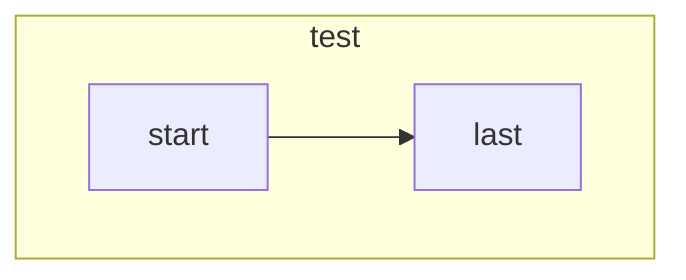

# RSS-crawler
-------
## 개요

'24. 3. 30. 일자 첫 외주 프로젝트 진행

'24. 3. 31. 20:30 ~ 

네이버 광고 수행 블로거 대상 최신 글 피드를 주기적으로 확인하고 갱신 시 블로거 별 시트에 업로드일시, 제목, url을 갱신

### 사용 기술

1. 크롤링에 사용하는 기술은 RSS

2. 크롤러 가동에 사용하는 어플리케이션은 로컬 PC에서 가동 가능한 exe build -> pyinstaller

3. exe 가동에 필요한 UI는 pyqt5

### what is RSS?

RSS(Really Simple Syndication, Rich Site Summary)

블로그와 같이 사용자들이 자주 최신글을 확인하고 싶어하는 사이트에 내장된 기능으로, 보다 간단하게 크롤링하여 최신 피드를 확인할 수 있는 통합 규격임

xml 파일로 구성되어 lxml로 까면 될듯

## 설계

